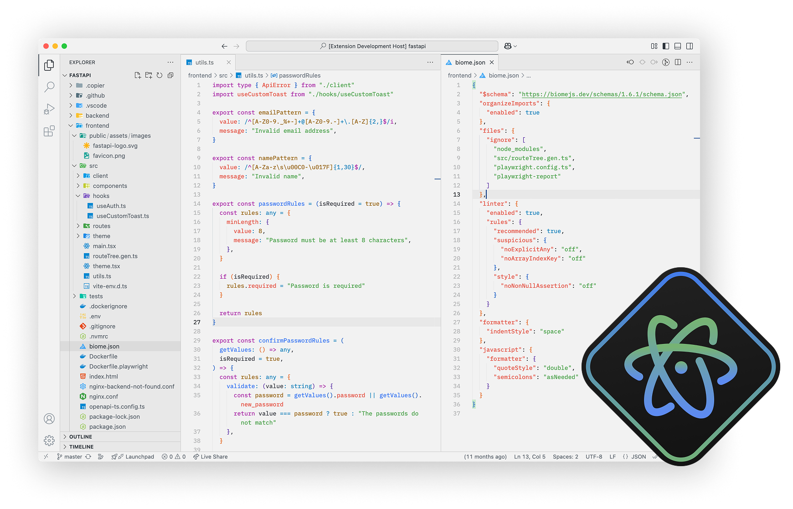

# Atom One Light Modern

A modern version of the Atom One Light theme.



## Installation

1. Open Visual Studio Code.
2. Navigate to the Extensions view by clicking the Extensions icon in the Activity Bar on the side of the window.
3. Search for Atom One Light Modern.
4. Click Install.

Or, install it directly via the command line:

```bash
code --install-extension mani-sh-reddy.atom-one-light-modern
```

## Usage

To activate the theme:

1. Open the Command Palette `Ctrl+Shift+P or Cmd+Shift+P on macOS`.
2. Type and select Preferences: Color Theme.
3. Choose _Atom One Light Modern_ from the available themes.

## Contributing

If you'd like to improve the theme, we welcome contributions! To contribute:

1. Fork the repository.
2. Create a new branch for your changes.
3. Make your changes and commit.
4. Open a pull request.

## License

This project is licensed under the MIT License. See the [LICENSE](./LICENSE) file for details.
